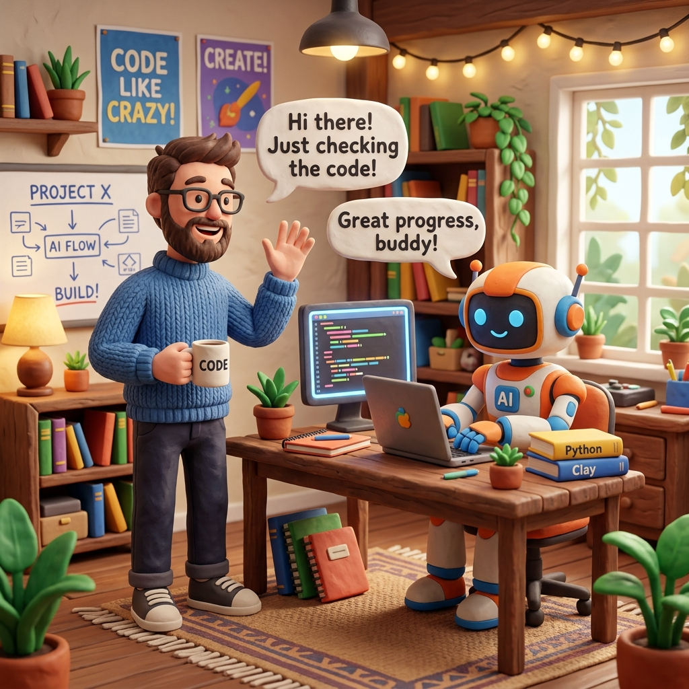

# 🌊 바이브 코딩(Vibe Coding): 새로운 물결
손끝의 타이핑에서 생각의 지휘(Directing)로

---

## 🌊 바이브 코딩이란?

* 직접 코드를 한 줄씩 작성하는 대신, 자연어로 **의도와 방향성(Vibe)** 을 제시
* AI가 실제 코드를 작성하고 코드베이스 구조화를 주도
* 개발자는 기계적 타이핑에서 벗어나 **창의적 문제 해결**에 몰입

---

## ⏳ 시대별 발전 과정

* **태동기 (2021~2023)**
  * GitHub Copilot, ChatGPT 출시
  * 대화형 코딩 및 AI 어시스턴트의 초기 형태 등장
* **발전기 (2023~2024)**
  * AI 네이티브 IDE 부상 (Cursor, Windsurf, Antigravity)
  * 프롬프트 엔지니어링의 중요성 대두
* **확산기 (2025)**
  * 안드레이 카파시(Andrej Karpathy)의 언급으로 '바이브 코딩' 용어 폭발적 유행
  * 코딩(Coding)에서 **디렉팅(Directing)** 으로 패러다임 전환

---

## 🚀 현재와 미래: 역할의 변화

* **진입 장벽 완화**
  * 기획자/디자이너도 아이디어만으로 프로토타입 제작 가능
* **개발자 정체성의 진화**
  * 단순 작성자(Coder) ➡️ **시스템 감독/지휘자(Director/Conductor)**
* **애자일(Agile)과의 결합**
  * '선 구축, 후 최적화' 방식을 통해 빠른 피드백 루프와 혁신 주도

---

## 🤖 현재와 미래: 에이전트 엔지니어링

* **다음 기술적 단계: 에이전트 엔지니어링(Agent Engineering)**
* 단순한 코드 생성을 넘어, 스스로 계획하고 도구를 사용하는 **자율형 AI 에이전트** 활용
* 개발자는 다수의 에이전트 워크플로우를 설계하고 조율하는 역할을 담당

---

## ⚠️ 한계와 새로운 과제

* **철저한 자동화 검증 필수**
  * AI 환각 현상 대비 (TDD, 타입 체커, CI/CD 파이프라인)
* **기술 부채 관리**
  * 작동은 하지만 내부를 모르는 '블랙박스' 문제 방지
  * AI 에이전트를 활용한 지속적인 코드 리뷰 및 문서화
* **인간 고유의 영역**
  * 비즈니스 목표 정렬, 독창성, 최종 판단은 언제나 **인간의 몫**

---

## 💡 결론

> 바이브 코딩은 기계적인 노동에서 벗어나, 
> 인간의 직관과 아이디어를 자연어로 표현해 
> AI와 함께 소프트웨어를 창조하는 
> 현시대를 가장 잘 보여주는 상징적인 개발 방식입니다.
