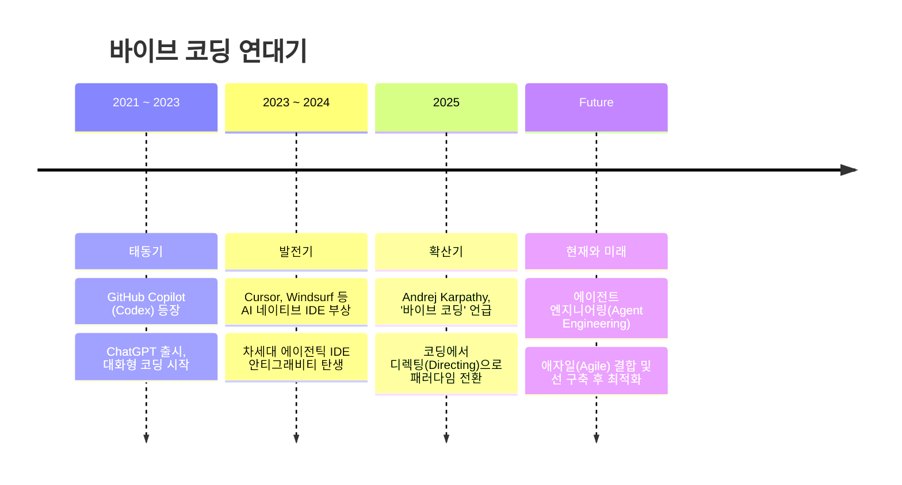
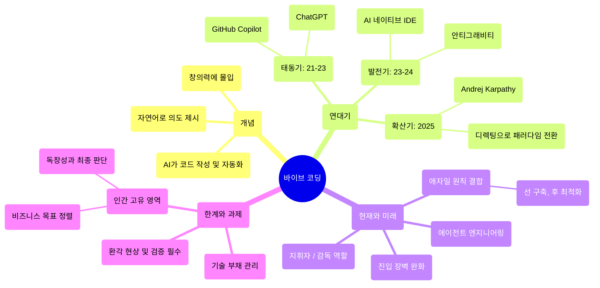

# 바이브 코딩(Vibe Coding)의 역사

바이브 코딩(Vibe Coding)은 AI의 발전과 함께 등장한 새로운 프로그래밍 패러다임으로, 코드를 한 줄 한 줄 직접 타이핑하는 대신 자연어로 의도와 방향성(Vibe)을 제시하고 AI가 실제 코드를 작성하게 하는 방식을 뜻합니다. 단순한 코드 완성을 넘어 번거로운 작업의 자동화와 표준 코드베이스 구조 생성까지 AI가 주도하며, 개발자가 창의력에 온전히 몰입할 수 있도록 돕습니다.

이 문서에서는 바이브 코딩이라는 개념이 어떻게 탄생하고 발전해왔는지 그 역사를 살펴봅니다.

## ⏳ 연대기 한눈에 보기

## 1. 태동기: AI 코딩 어시스턴트의 등장 (2021 ~ 2023)

바이브 코딩의 근간은 AI가 코드를 이해하고 생성할 수 있게 되면서 시작되었습니다.

* **GitHub Copilot (2021):** OpenAI의 Codex 모델을 기반으로 한 GitHub Copilot이 등장했습니다. 개발자가 주석이나 함수의 이름만 적어도 나머지 코드를 자동 완성해 주는 이 도구는 코딩 방식에 작은 혁명을 일으켰습니다.
* **ChatGPT의 출시 (2022 말):** 대화형 AI인 ChatGPT가 출시되면서 사람들은 자연어로 복잡한 로직의 코드를 요청하고, 버그 수정을 부탁하는 등 AI와 대화하며 코딩하는 방식을 경험하기 시작했습니다.

이 시기에는 AI가 보조적인 역할을 수행했지만, '자연어로 코딩한다'는 바이브 코딩의 초기 형태가 자리 잡기 시작한 시점입니다.

## 2. 발전기: AI 네이티브 IDE의 부상 (2023 ~ 2024)

기존 IDE에 플러그인 형태로 추가되던 AI가 아예 IDE의 핵심(Native)으로 자리 잡는 시기입니다.

* **Cursor(2023년)와 Windsurf(2024년 후반)의 등장:** VS Code를 포크(Fork)하여 만든 Cursor가 큰 인기를 끌었으며, 이후 에이전트 기능을 한층 강화한 Windsurf가 등장했습니다. 이들은 전체 코드베이스를 이해하고, 여러 파일에 걸친 수정을 한 번의 프롬프트로 해결해 주었습니다.
* **차세대 에이전틱 IDE, 안티그래비티(Antigravity)의 탄생:** Google DeepMind 팀의 주도하에 개발된 안티그래비티는 기존 AI 에디터를 넘어선 진정한 '자율형 코딩 어시스턴트'로 등장했습니다. 단순한 코드 완성을 넘어 개발자와 페어 프로그래밍을 하며 전체 워크플로우를 스스로 주도하는 수준으로 진화했습니다.
* **프롬프트 엔지니어링의 중요성 대두:** 코드를 어떻게 짤 것인가보다 AI에게 **'어떻게 요구할 것인가'**가 더 중요해졌습니다. 개발자들은 마이크로 매니징을 줄이고 더 큰 그림(아키텍처, 느낌, 로직 흐름)을 AI에게 설명하는 데 익숙해졌습니다.

## 3. 확산기: '바이브 코딩' 용어의 탄생과 유행 (2025)

기술이 무르익으면서 이 새로운 코딩 스타일을 지칭하는 밈(Meme)이자 용어로서 '바이브 코딩'이 폭발적으로 유행하기 시작했습니다.

* **안드레이 카파시(Andrej Karpathy)의 언급 (2025년 2월 3일):** 테슬라의 전 AI 디렉터이자 인공지능 분야의 석학인 안드레이 카파시가 X(트위터) 등을 통해 자신의 최근 코딩 방식을 설명하며 이 개념이 크게 주목받았습니다. 그는 "코드를 작성하는 것이 아니라 프롬프트를 작성하고 AI가 만들어낸 결과물의 바이브를 맞추며 작업한다"고 언급했습니다.
* **코딩에서 디렉팅으로:** 개발자 커뮤니티에서는 자신이 직접 키보드를 두드리는 시간보다, AI가 짠 코드를 리뷰(Review)하고 방향(Vibe)을 다시 지시하는 시간이 훨씬 길어졌다는 공감대가 형성되었습니다.

## 4. 현재와 미래: 새로운 개발자 정체성의 확립

바이브 코딩은 단순한 유행어를 넘어 프로그래밍의 기본 패러다임을 바꾸고 있습니다.

* **진입 장벽의 완화:** 프로그래밍 문법을 완벽히 모르는 기획자나 디자이너도 아이디어(Vibe)만 있다면 동작하는 프로토타입을 만들 수 있게 되었습니다.
* **개발자의 역할 변화:** 미래의 개발자는 코드 '작성자(Coder)'라기보다는 시스템을 설계하고 AI를 지휘하는 '오케스트라 지휘자(Conductor)' 또는 '감독(Director)'에 가까워지고 있습니다.
* **애자일(Agile)과 '선 구축, 후 최적화'의 결합:** 바이브 코딩은 빠른 프로토타이핑과 순환적 피드백 루프를 중시하는 애자일 원칙과 완벽하게 부합합니다. '먼저 코드를 작성하고 나중에 개선한다'는 실험 우선주의적 사고방식을 통해 기업과 개발자는 혁신과 직관적 문제 해결에 더욱 집중할 수 있게 되었습니다.
* **에이전트 엔지니어링(Agent Engineering)으로의 진화:** 바이브 코딩이 직관과 흐름(Vibe)에 집중하는 패러다임이라면, 이를 실현하는 기술적 다음 단계는 '에이전트 엔지니어링'입니다. 개발자는 단순 코드 작성을 넘어 스스로 계획을 세우고 도구를 사용하며 검증하는 안티그래비티(Antigravity), Devin, GitHub Spark와 같은 자율형 'AI 에이전트'들의 워크플로우를 설계하고 조율하는 역할을 맡게 됩니다.

## 5. 바이브 코딩의 한계와 새로운 과제

개발 패러다임의 혁신에도 불구하고, 바이브 코딩은 몇 가지 주의해야 할 한계점과 새로운 과제를 안고 있습니다.

* **환각 현상(Hallucination)과 검증의 필수화:** AI가 작성한 코드가 항상 논리적으로 완벽하거나 정답인 것은 아닙니다. 따라서 TDD(테스트 주도 개발), 타입 체커(Type Checker)의 적극적인 활용, 그리고 자동화된 CI/CD 파이프라인 구축을 통한 '철저한 자동화 검증'이 바이브 코딩을 완성하는 필수 조건이 되었습니다.
* **블랙박스와 기술 부채(Technical Debt)의 가속화:** 개발자가 로직의 세세한 부분을 직접 짜지 않으면서, "시스템은 완벽하게 작동하지만 내부 구조를 100% 이해하는 사람은 없는" 형태의 새로운 기술 부채가 쌓일 위험이 커졌습니다. 이를 방지하기 위해 AI 에이전트를 활용한 지속적인 아키텍처 문서화와 코드 리뷰가 더욱 중요해졌습니다.
* **인간 고유 영역의 재조명:** AI는 훌륭한 생산성 도구지만, 비즈니스 목표와의 일치(Alignment), 진정한 창의성, 독창적 사고는 오직 인간의 몫입니다. AI가 코드를 빠르게 생성하더라도 최종적인 판단과 감독은 반드시 인간이 주도해야 합니다.

---
> **요약하자면**, 바이브 코딩은 AI 도구의 발전으로 인해 문법적이고 기계적인 타이핑 노동에서 벗어나, 인간의 직관과 아이디어를 자연어로 표현하여 소프트웨어를 창조하는 현시대를 가장 잘 보여주는 상징적인 단어입니다.

## 🧠 바이브 코딩 핵심 마인드맵 (Mind Map)

