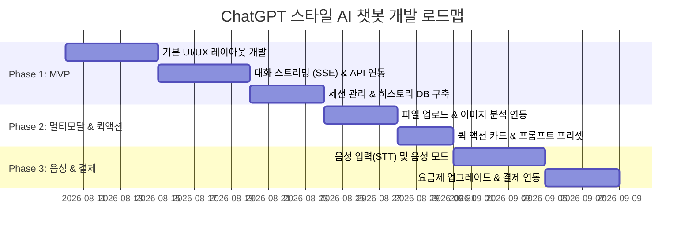

# [PRD] ChatGPT 스타일 AI 챗봇 서비스 제품 기능 명세서

---

## 1. 문서 개요
- **문서명**: ChatGPT 스타일 AI 웹 챗봇 서비스 PRD (Product Requirement Document)
- **작성자**: 제품 기획자 서브에이전트 (Planner Subagent)
- **작성일**: 2026-08-08
- **상태**: Draft (기획 검토 단계)

---

## 2. 서비스 목표 및 배경

### 2.1 서비스 목표
- 사용자가 직관적이고 직관적인 웹 인터페이스를 통해 AI와 자연스럽게 대화하고, 다양한 생산성 도구(이미지 생성, 글쓰기, 웹 검색, 음성 대화 등)를 쉽게 활용할 수 있는 **대화형 AI 챗봇 서비스** 구축.

### 2.2 핵심 가치 (Core Value)
1. **직관적인 UX**: 대화 집중형 메인 화면 및 효율적인 세션 관리가 가능한 사이드바 구조 제공.
2. **다양한 인터랙션**: 텍스트, 이미지 생성, 웹 검색, 음성 대화를 아우르는 멀티모달 대화 경험.
3. **생산성 극대화**: 퀵 액션 추천 카드, 코드 실행(Codex), 프로젝트/라이브러리 관리 지원.

---

## 3. UI/UX 화면 구성 및 레이아웃 정의

### 3.1 레이아웃 전체 구조 (Wireframe Overview)
+-----------------------------------------------------------------------------------------+
| [≡] Logo  ChatGPT [v]                                           [✦ 플랜 업그레이드] (↻)   |
+-------------------+---------------------------------------------------------------------+
| [ + 새 채팅 ]     |                                                                     |
| 🖼️ 이미지         |                      오늘은 무슨 이야기를 할까요?                    |
| 📚 라이브러리     |                                                                     |
| @ 플러그인        |      +-------------------------------------------------------+      |
| 📁 프로젝트       |      | (+)  무엇이든 물어보세요                      (🎤) (🎙️) |      |
| 💻 Codex          |      +-------------------------------------------------------+      |
| ⋯ 더 보기         |                                                                     |
|                   |      [ 🖼️ 이미지 만들기 ]   [ ✏️ 글쓰기 ]   [ 🌐 웹 검색 ]             |
| [최근]            |                                                                     |
| - 퍼스널 컬러 진단|                                                                     |
| - 계약서 검토     |                                                                     |
| - 파이썬 판다스   |                                                                     |
| ...               |                                                                     |
+-------------------+                                                                     |
| (DA) Dandy        | Footer: OpenAI OpCo, LLC | 약관 | Azure 호스팅 등 법적 고지            |
|      [업그레이드] |                                                                     |
+-------------------+---------------------------------------------------------------------+

---

### 3.2 주요 영역별 세부 명세

#### 1) 좌측 사이드바 (Left Navigation Drawer)
- **최상단 브랜드/메뉴**: 사이드바 토글 버튼 (접기/펼치기)
- **주요 탐색 버튼**:
  - `새 채팅 (+ New Chat)`: 클릭 시 새로운 대화 세션 생성 및 메인 화면 초기화.
  - `이미지`: AI 이미지 생성 전용 인터페이스/갤러리 이동.
  - `라이브러리`: 사용자가 저장한 프롬프트 및 대화 즐겨찾기 목록.
  - `@ 플러그인`: 타사 서비스 연동 플러그인 관리.
  - `프로젝트`: 프로젝트별 대화 및 파일 묶음 관리.
  - `Codex`: 코드 생성 및 인터프리터 실행 환경.
  - `... 더 보기`: 추가 메뉴 확장.
- **최근 대화 히스토리 (Recent History)**:
  - 역순 시간순 대화 세션 목록 표시 (예: 퍼스널 컬러 진단, 계약서 검토 및 수정, 파이썬 판다스 데이터 분석, 테슬라 주식 현황 등).
  - 마우스 호버 시 세션 이름 변경, 공유, 삭제 아이콘 노출.
- **하단 사용자 프로필 영역**:
  - 사용자 아바타, 계정명 (`Dandy`), 현재 요금제 (`Free`).
  - `업그레이드` 버튼: Pro/Plus 결제 모달/페이지 호출.

#### 2) 메인 대화 영역 (Main Chat Canvas)
- **상단 헤더 (Header Bar)**:
  - 모델 선택 드롭다운 (`ChatGPT v`): LLM 모델 변경 (GPT-4o, GPT-4, GPT-3.5 등).
  - `플랜 업그레이드` 버튼 & 새로고침 아이콘.
- **초기 상태 (Hero / Empty State)**:
  - 중앙 메시지: `"오늘은 무슨 이야기를 할까요?"`
- **입력 창 (Floating Input Box)**:
  - `+` 버튼: 파일 첨부 (이미지, 문서 등) 및 추가 도구 메뉴.
  - 텍스트 입력 영역: 자동 높이 조절 Textarea (Enter 입력 시 전송, Shift+Enter 줄바꿈).
  - `마이크 아이콘 (🎤)`: STT (Speech-to-Text) 음성 입력 받아 쓰기.
  - `보이스 모드 아이콘 (🎙️)`: 실시간 음성 대화 모달 실행.
- **빠른 실행 추천 카드 (Quick Action Cards)**:
  - `🖼️ 이미지 만들기`: DALL-E 기반 이미지 생성 프롬프트 가이드 입력.
  - `✏️ 글쓰기`: 이메일, 초안, 에세이 작성 프롬프트 가이드 입력.
  - `🌐 웹 검색`: 최신 정보 탐색을 위한 웹 검색 보조 모드 활성화.
- **하단 푸터 (Footer Notice)**:
  - 통신판매업 및 사업자 정보, 법적 고지, 호스팅 서비스 제공자 안내 문구.

---

## 4. 상세 기능 명세 (Functional Specifications)

| 기능 ID | 기능명 | 설명 | 우선순위 |
| :--- | :--- | :--- | :--- |
| **F-01** | 대화 스트리밍 (SSE) | Server-Sent Events를 이용하여 AI 응답을 실시간 타자 치듯 스트리밍 출력 | **Must Have** |
| **F-02** | 대화 세션 관리 | 새 대화 생성, 히스토리 자동 저장, LLM 기반 세션 제목 자동 요약, 세션 삭제 | **Must Have** |
| **F-03** | 모델 선택기 | 상단 드롭다운을 통한 사용할 AI 모델 선택 및 상태 유지 | **Must Have** |
| **F-04** | 멀티모달 파일 첨부 | `+` 버튼을 통한 이미지 및 문서 파일 업로드 및 프롬프트 전달 | **Must Have** |
| **F-05** | 퀵 액션 추천 카드 | 초기 메인 화면 카드 클릭 시 해당 기능에 맞는 프롬프트 입력창 자동 세팅 | **Should Have** |
| **F-06** | 음성 입력 및 보이스 모드 | STT 기반 음성 텍스트 입력 및 실시간 음성 대화 인터페이스 | **Should Have** |
| **F-07** | 웹 검색 연동 | 외부 검색 API와 연동하여 실시간 웹 검색 결과 답변 제공 | **Should Have** |
| **F-08** | 플러그인 및 Codex | 코드 인터프리터 실행 환경 및 외부 서비스 연동 플러그인 | **Nice to Have** |
| **F-09** | 요금제/구독 결제 | Free / Pro 요금제 분리 및 PG사 결제 연동 | **Nice to Have** |

---

## 5. 데이터 모델 및 API 아키텍처 제안

### 5.1 주요 데이터 구조 (Entities)
1. **User (사용자)**: `id`, `name`, `email`, `plan_type` ('free' | 'pro'), `created_at`
2. **ChatSession (대화 세션)**: `id`, `user_id`, `title`, `model`, `created_at`, `updated_at`
3. **ChatMessage (메시지)**: `id`, `session_id`, `sender` ('user' | 'assistant' | 'system'), `content`, `attachments`, `created_at`

### 5.2 API 엔드포인트 설계 (Summary)
- `POST /api/chat/completions` (SSE 스트리밍 응답 제공)
- `GET /api/sessions` (최근 대화 히스토리 목록 조회)
- `POST /api/sessions` (새 대화 세션 생성)
- `PATCH /api/sessions/:id` (대화 제목 수정)
- `DELETE /api/sessions/:id` (대화 세션 삭제)
- `POST /api/upload` (이미지/문서 파일 업로드)

---

## 6. 개발 단계별 로드맵 (Roadmap)

---

## 7. 기대 효과 및 결론
- 본 PRD에 정의된 ChatGPT 스타일 UI/UX 구현을 통해 사용자에게 친숙하고 빠른 대화 경험을 제공할 수 있습니다.
- MVP 단계에서 핵심인 **대화 스트리밍 및 세션 관리**를 빠르게 구축한 뒤, 멀티모달 및 음성 대화 기능으로 확장하는 전략을 권장합니다.
