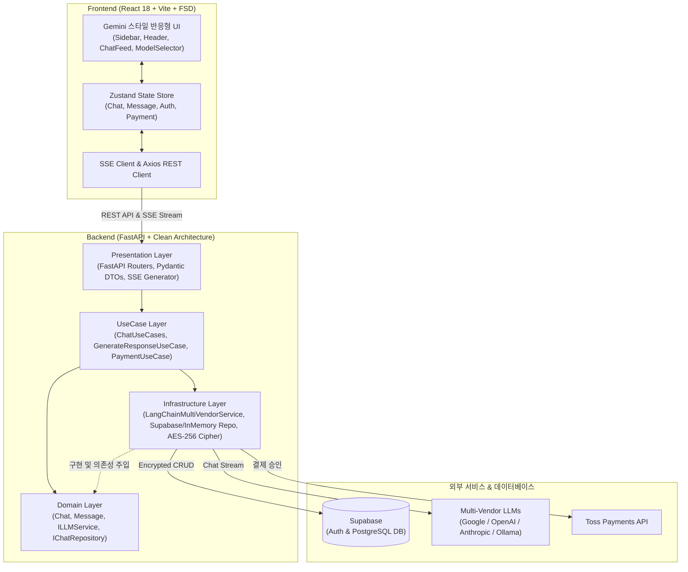

# 🚀 Jemini (Full-Stack Multi-Vendor AI Chatbot)

<div align="center">


<br/>

**Jemini**는 Google Gemini 스타일의 세련된 UI/UX와 **Clean Architecture** 기반의 FastAPI 백엔드가 결합된 프로덕션급 풀스택 멀티 벤더 AI 챗봇 플랫폼입니다.

[빠른 시작](#-빠른-시작-quick-start) • [주요 기능](#-주요-기능-key-features) • [아키텍처](#-시스템-아키텍처-system-architecture) • [서브 프로젝트](#-서브-프로젝트-안내) • [배포 가이드](#-클라우드-배포-deployment)

</div>

---

## ✨ 주요 기능 (Key Features)

- 🤖 **멀티 벤더 LLM 오케스트레이션 (LangChain Multi-Vendor)**
  - Google Gemini (`gemini-1.5-flash`, `gemini-1.5-pro` 등)
  - OpenAI (`gpt-4o`, `gpt-4o-mini`)
  - Anthropic (`claude-3-5-sonnet`, `claude-3-haiku`)
  - 로컬 LLM (Ollama)
  - 런타임 중 모델을 자유롭게 전환하여 대화 가능
- ⚡ **실시간 SSE (Server-Sent Events) 스트리밍**
  - AI 응답을 청크 단위로 실시간 타이핑 렌더링
  - 스마트 후속 추천 질문(`<suggestions>`) 자동 추출 및 추천 칩 UI 제공
- 🎨 **Google Gemini 감성의 모던 UI/UX**
  - 반응형 접이식 사이드바 (대화 목록 관리, 세션 생성 및 삭제)
  - 자동 리사이징 플로팅 프롬프트 입력창
  - React Markdown 기반 렌더링 & PrismJS 코드 블록 구문 강조 및 원클릭 복사
- 🔒 **철저한 데이터 보안 & 암호화 (Data Privacy)**
  - AES-256-GCM 대칭키 암호화로 DB 저장 시 대화 내용 보호 및 복호화
  - Supabase Auth 기반 인증 및 Row Level Security (RLS) 적용
- 💳 **토스페이먼츠(Toss Payments) 결제 연동**
  - 결제 위젯 연동 및 서버 결제 승인 API(`payments_router.py`) 구현
- 🛡️ **Zero-Config 로컬 개발 환경 지원 (Graceful Fallback)**
  - API 키나 외부 DB 설정이 없어도 **In-Memory 저장소**와 **Simulated Gemini 서비스**로 즉시 로컬 실행 및 체험 가능

---

## 🏗️ 시스템 아키텍처 (System Architecture)



---

## 📁 서브 프로젝트 안내

각 서브 프로젝트의 상세한 아키텍처, 환경 설정 및 기능 설명은 하위 디렉터리의 문서를 참조하십시오.

| 서브 프로젝트 | 아키텍처 / 기술 스택 | 설명서 | AI 에이전트 가이드 |
|---|---|---|---|
| **Backend** (`backend/`) | Clean Architecture, FastAPI, LangChain, `uv`, pytest | [backend/README.md](backend/README.md) | [backend/AGENTS.md](backend/AGENTS.md) |
| **Frontend** (`frontend/`) | Feature-Sliced Design (FSD), React 18, Vite, TypeScript, Zustand | [frontend/README.md](frontend/README.md) | [frontend/AGENTS.md](frontend/AGENTS.md) |

---

## 📂 모노레포 디렉터리 구조

```text
jemini/
├── backend/                         # FastAPI 백엔드 (Clean Architecture)
│   ├── app/
│   │   ├── domain/                  # 엔티티 및 인터페이스 (Chat, Message, Repository/LLM 추상화)
│   │   ├── usecases/                # 비즈니스 로직 유스케이스 (채팅 CRUD, SSE 응답 생성 등)
│   │   ├── infrastructure/          # 구현체 (LangChain, Supabase, InMemory, AES-256 Cipher)
│   │   └── presentation/            # FastAPI 라우터 (chats, generate, payments) 및 DTO
│   ├── tests/                       # pytest 테스트 슈트 (단위, 통합, E2E)
│   ├── main.py                      # FastAPI 엔트리포인트
│   └── pyproject.toml               # Python 의존성 관리 (uv)
│
├── frontend/                        # React 프론트엔드 (Feature-Sliced Design)
│   ├── src/
│   │   ├── app/                     # 진입점 및 전역 스타일
│   │   ├── pages/                   # 페이지 단위 컴포넌트 (ChatPage)
│   │   ├── widgets/                 # 복합 UI 블록 (Sidebar, ChatFeed, Header)
│   │   ├── features/                # 사용자 액션 (ModelSelector, SendMessage, Payment, Auth)
│   │   ├── entities/                # 엔티티 모델 및 Zustand 스토어 (Chat, Message, User)
│   │   └── shared/                  # 공통 UI, API 클라이언트, 상수 유틸리티
│   ├── package.json                 # Node.js 의존성 메타데이터
│   └── vite.config.js               # Vite 번들러 및 프록시 설정
│
├── render.yaml                      # Render Blueprint 인프라 배포 설정
├── DEPLOYMENT.md                    # 클라우드 프로덕션 배포 완벽 가이드
├── AGENTS.md                        # AI 코딩 에이전트 개발 표준 가이드
└── README.md                        # 프로젝트 메인 안내서
```

---

## 🚀 빠른 시작 (Quick Start)

### 📌 사전 준비
- Python 3.10+ 및 [uv](https://github.com/astral-sh/uv) (백엔드 패키지 매니저)
- Node.js 18+ 및 npm (프론트엔드)

---

### 1. 백엔드 실행 (Backend)

```bash
# 1) 백엔드 디렉터리로 이동
cd backend

# 2) 의존성 패키지 동기화 (uv 사용)
uv sync

# 3) (선택) 환경 변수 파일 복사 및 설정
cp .env.example .env

# 4) 개발 서버 실행
uv run uvicorn main:app --reload --port 8000
```

- **API 서버 주소**: `http://localhost:8000`
- **대화형 API 문서 (Swagger UI)**: `http://localhost:8000/docs`
- **대체 문서 (ReDoc)**: `http://localhost:8000/redoc`

> 💡 **Tip**: `.env` 파일에 API 키를 넣지 않아도 Mock/In-Memory 모드로 바로 동작합니다.

---

### 2. 프론트엔드 실행 (Frontend)

```bash
# 1) 새 터미널에서 프론트엔드 디렉터리로 이동
cd frontend

# 2) 의존성 패키지 설치
npm install

# 3) (선택) 환경 변수 파일 복사 및 설정
cp .env.example .env

# 4) Vite 개발 서버 실행
npm run dev
```

- **웹 애플리케이션 주소**: `http://localhost:3000`
- Vite 프록시가 설정되어 있어 `/api` 요청은 자동으로 로컬 백엔드(`http://localhost:8000`)로 전달됩니다.

---

## 🔑 환경 변수 가이드 (Environment Variables)

### 백엔드 (`backend/.env`)

| 변수명 | 필수 여부 | 설명 | 기본 동작 (미설정 시) |
|---|:---:|---|---|
| `GEMINI_API_KEY` | 선택 | Google Gemini API Key | 미설정 시 Mock 응답 스트리밍 동작 |
| `OPENAI_API_KEY` | 선택 | OpenAI API Key (GPT-4o 등) | 미설정 시 해당 모델 호출 불가 |
| `ANTHROPIC_API_KEY` | 선택 | Anthropic Claude API Key | 미설정 시 해당 모델 호출 불가 |
| `OLLAMA_BASE_URL` | 선택 | 로컬 Ollama 서버 주소 | 기본값: `http://localhost:11434` |
| `SUPABASE_URL` | 선택 | Supabase Project URL | 미설정 시 In-Memory DB로 동작 |
| `SUPABASE_KEY` | 선택 | Supabase Anon/Service Key | 미설정 시 In-Memory DB로 동작 |
| `CHAT_ENCRYPTION_KEY` | 선택 | AES-256 데이터 암호화 키 (32바이트 Base64) | 대화 내용 암호화 적용 |
| `TOSS_SECRET_KEY` | 선택 | 토스페이먼츠 시크릿 키 | 결제 승인 API 검증용 |

### 프론트엔드 (`frontend/.env`)

| 변수명 | 필수 여부 | 설명 |
|---|:---:|---|
| `VITE_API_BASE_URL` | 선택 (로컬) / 필수 (배포) | 백엔드 API 서버 기본 URL (예: `https://jemini-backend.onrender.com`) |
| `VITE_SUPABASE_URL` | 선택 | Supabase Auth 연동용 프로젝트 URL |
| `VITE_SUPABASE_PUBLISHABLE_KEY` | 선택 | Supabase 클라이언트용 Anon Key |
| `VITE_TOSS_CLIENT_KEY` | 선택 | 토스페이먼츠 클라이언트 키 (`test_ck_...`) |

---

## 🧪 테스트 및 품질 검증 (Testing)

### 백엔드 테스트 (pytest)
```bash
cd backend

# 전체 테스트 실행
uv run pytest

# 계층별 테스트 실행
uv run pytest tests/unit          # 단위 테스트 (Domain, UseCase, Services)
uv run pytest tests/integration   # 통합 테스트 (Repository CRUD)
uv run pytest tests/e2e           # E2E API 엔드포인트 테스트
```

### 프론트엔드 빌드 검증
```bash
cd frontend

# TypeScript 타입 검사 및 프로덕션 빌드
npm run build

# 빌드 결과물 미리보기
npm run preview
```

---

## 🌐 클라우드 배포 (Deployment)

Jemini 프로젝트는 **Render Blueprint (`render.yaml`)** 기반의 원클릭 배포를 완벽하게 지원합니다.

1. GitHub 저장소에 코드를 푸시합니다.
2. [Render Dashboard](https://dashboard.render.com/)에서 **New + ➡️ Blueprint**를 선택하고 저장소를 연결합니다.
3. `render.yaml` 설정에 따라 **FastAPI Web Service**와 **React Static Site**가 자동으로 프로비저닝 및 배포됩니다.

> 📖 세부 배포 절차, Supabase 스키마 마이그레이션 및 커스텀 도메인 설정은 **[DEPLOYMENT.md](DEPLOYMENT.md)** 문서를 확인하세요.

---

## 🤖 AI 에이전트 개발 지침

AI 코딩 에이전트를 활용한 개발 규칙, 아키텍처 제약 사항 및 계층별 의존성 방향은 **[AGENTS.md](AGENTS.md)**에 명시되어 있습니다.

---

<div align="center">
  <sub>Built with ❤️ using FastAPI, React, LangChain & Clean Architecture.</sub>
</div>